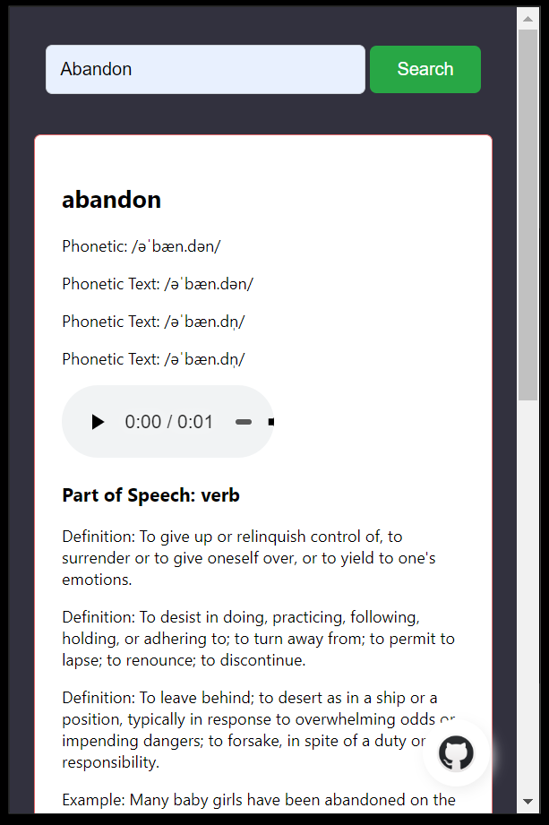

# Dictionary Extension

The WordSearch Extension is a versatile dictionary tool designed to provide users with comprehensive information about words, including definitions, pronunciations, synonyms, antonyms, verb forms, and more. Developed using HTML, CSS, JavaScript, and Fetch API with JSON data, this extension offers a user-friendly interface for efficiently searching and exploring the nuances of various words.

## Features:

### Word Definitions:

Upon entering a word, users receive accurate and detailed definitions, helping them grasp the meaning and usage of the word in different contexts.
### Pronunciation Guide:

The extension offers pronunciation guides for words, aiding users in understanding how to pronounce them correctly. This feature is particularly useful for language learners and individuals seeking to enhance their verbal communication skills.
### Synonyms and Antonyms:

Users can explore synonyms and antonyms associated with the searched word, facilitating vocabulary expansion and promoting linguistic diversity in writing and speech.
### Verb Forms:

For verbs, the extension provides various verb forms (such as present tense, past tense, past participle, and gerund), enabling users to understand the conjugation patterns and use the word effectively in different grammatical contexts.
### Fetch API Integration:

Leveraging the Fetch API, the extension retrieves data from an external JSON source, ensuring the availability of up-to-date and accurate information for each word searched.
### Responsive Design:

The extension features a responsive design, making it accessible across different devices and screen sizes. Whether users access it from a desktop computer, tablet, or smartphone, they can enjoy a seamless browsing experience.
Intuitive User Interface:

With a clean and intuitive user interface, the WordSearch Extension prioritizes ease of use. Users can quickly enter words, navigate through search results, and access relevant information without encountering any complexity.
### Lightweight and Fast:

The extension is designed to be lightweight and fast, ensuring swift retrieval of word data and minimal loading times. This optimizes the user experience and facilitates smooth interaction with the tool.

## Authors
### Nitesh Bhaiya
- [GitHub](https://www.github.com/niteshbhaiya4224) 

- [LinkedIn](https://www.linkedin.com/in/nitesh-bhaiya) 

## Demo

## 🚀 About Me

I am Nitesh Bhaiya, a skilled fresher with a Bachelor of Technology degree from Haldia Institute of Technology. My expertise lies in Java, HTML, CSS, MySQL, and Spring Boot. I am passionate about coding and have a strong foundation in software development principles and practices.

With my solid technical skills, I have a keen eye for detail and a proven ability to develop robust and efficient applications. I have hands-on experience in developing web applications using Java, HTML, CSS, and MySQL, and have a good understanding of Spring Boot framework for building scalable and maintainable applications.

As a quick learner, I am always eager to explore new technologies and stay up-to-date with the latest industry trends. I am a team player and possess excellent problem-solving skills, allowing me to effectively collaborate with cross-functional teams to deliver high-quality solutions.

In addition to my technical expertise, I am a strong communicator with good interpersonal skills, making me adept at understanding client requirements and translating them into functional solutions. I am committed to continuous learning and professional growth, and I am confident that my skills and dedication will make me a valuable asset to any IT company.

I am seeking an opportunity to work in a dynamic and challenging environment where I can contribute my technical skills and creativity to develop innovative software solutions that drive business success. I am excited about the prospect of working with cutting-edge technologies and making a meaningful impact in the IT industry.I am Nitesh Bhaiya, a skil

## 🛠 Skills
Java, Spring Boot, Javascript, HTML, CSS, Thymeleaf, DBMS, MySql, WebApp Devlopment, Restful Services ..... 

## Tech Stack

**Client:** Html, CSS, Javascript, JSON

